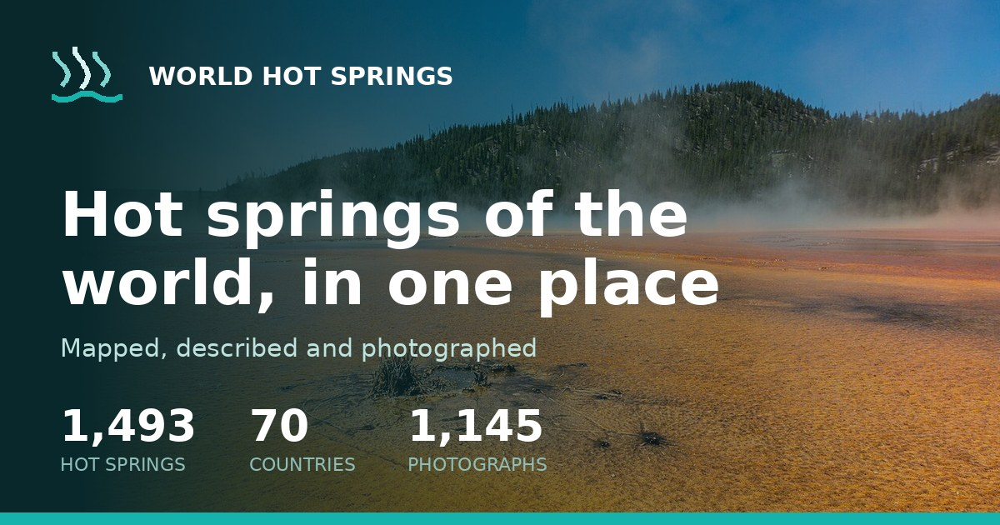

<h1 align="center">World Hot Springs</h1>

<i>Hot springs of the world, in one place.</i>

  
  

## About

World Hot Springs is a global directory built on a Wikidata + Wikimedia Commons data pipeline. It maps, describes and illustrates hot springs worldwide, with a thin-content guard that keeps low-value pages out of the index so only genuinely useful pages get crawled.

## Key features

- **Data pipeline** — locations and facts sourced from Wikidata, imagery from Wikimedia Commons
- **Global coverage** — hot springs mapped, described and photographed across many countries
- **Thin-content guard** — automatic noindex rule so only useful pages get indexed
- **SEO-first structure** — structured data, sitemaps and fast pages

## Built with

   

## About this repository

This is a **case study** of a production project I designed, built and maintain. The application is live at **[worldhotsprings.com](https://worldhotsprings.com/)**. The source code is proprietary and kept private — this page documents the work and the engineering behind it.

---

Built by <b><a href="https://jeemmo.com/">Azeem Javed (Jeemmo)</a></b> · <a href="https://www.linkedin.com/in/azeem-javed-7666861a/">LinkedIn</a> · Jeemmo is the trading name of Verivello Ltd, a UK-registered company.
